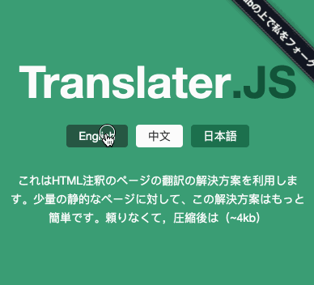

# mini i18n js

This repo is forked from [aywcjlove/translater.js](https://github.com/jaywcjlove/translater.js) , added some changes and improvements.

---

轻量的 HTML 多语言解决方案。仅需依赖一个 JS 文件，直接在 HTML 里通过注释的形式写多语言翻译，无需复杂的配置。

- 支持通过 url 参数控制展示的语言
- 支持 js 方法切换语言
- 通过 localStorage 缓存用户的语言选择



## 用法

下载 `dist/mimii18n.js` 或者 `dist/minii18n.min.js`。

在 HTML 文件中，标签里的文本是 default 默认语言，其他语言用下面的格式写成注释的形式：

```html
<div>
  这里是中文
  <!--{jp}ここは日本語です-->
  <!--{en}Here is English-->
</div>
<script src="minii18n.js" type="text/javascript"></script>
<script type="text/javascript">
    // 初始化，使用默认语言
    var minii18n = new Minii18n();

    // 或者，使用指定的语言来初始化
    var minii18n = new Minii18n({
      lang:"jp"
    }));
    
</script>
```

> 注意：通过初始化的方式指定语言，不会改变 localStorage 中的内容。并且，如果 localStorage 中有用户的偏好，则会以用户偏好为准。

切换语言，通过 `minii18n.setLang('cn')` 即可。例如，通过 a 链接切换语言：

```html
<a href="javascript:minii18n.setLang('default');">English</a>
<a href="javascript:minii18n.setLang('jp');">日本語</a>
<a href="javascript:minii18n.setLang('cn');">中文</a>
```

> 注意：调用 setLang 方法，将更新 localStorage 中的内容。

获得当前语言，通过 `minii18n.getLang()` 即可。

当页面 url 带有 lang 参数时，将优先展示 lang 参数指定的语言。

```url
http://127.0.0.1:9005/test/test.html?lang=jp
```

**参数优先级**

- 如果页面带有 url 参数，则以 url 参数指定的语言为准。（但不会修改用户的设置）
- 如果没有 url 参数，但 localStorage 有用户的设置信息，则以用户设置为准。 
- 如果没有 url 参数，也没有 localStorage 信息，则以创建 minii18n 对象时设定的语言为准 （但不会修改用户的设置）
- 如果没有 url 参数，也没有 localStorage 信息，创建 minii18n 对象时也没有传入语言参数，则使用 default 语言。

## 多语言设定方式

**标签文本多语言**

```html
<div>
  这里是中文
  <!--{jp}ここは日本語です-->
  <!--{en}Here is English-->
</div>
```

**图片的alt多语言**

```html

```

**input的placeholder多语言**

```html
<input type="text" placeholder="like this?"  placeholder-cn="像这样？"  />
<input type="button" value="button" value-cn="按钮" value-jp="按钮日本"  />
```

## 开发

如需修改开发本仓库，直接 clone 后，运行 `npm install`。

修改 `src/minii18n.js` 文件。修改后，运行 `npm run build` 自动完成打包和压缩，输出会放在 `dist/` 中，包含原版和压缩版本的 js 文件。

